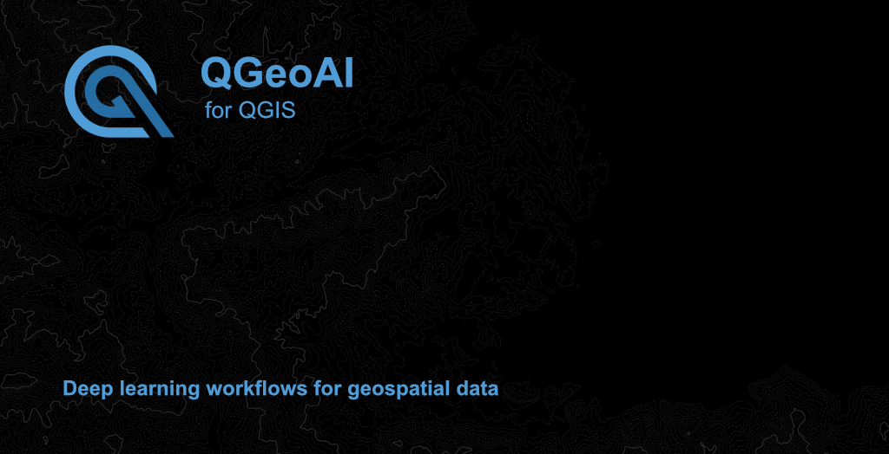

<div align="center">

# QModel Trainer

### Train deep learning models for geospatial applications directly in QGIS

<p>
  
  
  
  
  
</p>

<p>
  <a href="https://qgeoai.nextelia.fr">📚 Documentation</a> •
  <a href="https://github.com/nextelia/qgeoai_server">🖥️ Server</a>
</p>



---

</div>

## Key Features

<div align="center">
<table>
<tr>
<td width="50%">

**Multiple Architectures**
- Semantic segmentation (SMP: UNet, DeepLabV3+, etc.)
- Instance segmentation (Mask R-CNN)
- Object detection (YOLO11, YOLO11-obb)
- Instance segmentation (YOLO11-seg)

</td>
<td width="50%">

**Advanced Training**
- Real-time monitoring & metrics
- Data augmentation (geometric & radiometric)
- Learning rate finder
- Optimizer & scheduler selection
- Resume training from checkpoints
- Early stopping

</td>
</tr>
</table>
</div>

## Quick Start

### Prerequisites

- **QGIS 3.40 LTE** or higher
- **[QGeoAI Server](https://github.com/nextelia/qgeoai_server)** (required for training)
- **CUDA-capable GPU** (recommended) or CPU
- **QAnnotate** datasets or compatible formats

### Installation

1. Download the plugin from [Releases](../../releases) or clone this repository
2. Copy `qmodeltrainer/` to your QGIS plugins directory:
```bash
   # Windows
   %APPDATA%\QGIS\QGIS3\profiles\default\python\plugins\
   
   # Linux
   ~/.local/share/QGIS/QGIS3/profiles/default/python/plugins/
   
   # macOS
   ~/Library/Application Support/QGIS/QGIS3/profiles/default/python/plugins/
```
3. Restart QGIS and enable the plugin via `Plugins` → `Manage and Install Plugins`

**Full documentation**: [qgeoai.nextelia.fr](https://qgeoai.nextelia.fr)

## Workflow

1. **Prepare dataset** with QAnnotate (COCO, YOLO11, or mask format)
2. **Configure model** (architecture, backbone, hyperparameters)
3. **Set augmentations** (optional: flips, rotations, brightness, etc.)
4. **Start training** with real-time monitoring
5. **Export to QMTP** format for use with QPredict

## Supported Tasks

| Task | Architectures | Use Cases |
|------|--------------|-----------|
| **Semantic Segmentation** | UNet, UNet++, DeepLabV3+, FPN, PSPNet, etc. | Land cover, vegetation mapping |
| **Instance Segmentation** | Mask R-CNN, YOLO11-seg | Building detection, tree counting |
| **Object Detection** | YOLO11, YOLO11-obb | Vehicle detection, infrastructure monitoring |

## Why QModel Trainer?

- ✅ **No-code training**: User-friendly interface, no Python scripting
- ✅ **Production-ready**: GPU acceleration, checkpoint management, HTML reports
- ✅ **Geospatial optimized**: Handles large rasters, multi-band imagery, CRS preservation
- ✅ **Flexible**: Multiple architectures, backbones, and hyperparameter options
- ✅ **Open source**: GPLv2+ license, fully auditable

## Support & Contribution

### Community Support

**Documentation**: [qgeoai.nextelia.fr](https://qgeoai.nextelia.fr)

### Professional Support

For operational support, custom integrations, or training:

- **Email**: [hello@nextelia.fr](mailto:hello@nextelia.fr)
- **Website**: [nextelia.fr](https://nextelia.fr)

The suite is free and open-source. Professional services ensure sustainable development.

### Contributing

This project is developed as an open, production-grade GeoAI platform for QGIS.

We welcome:
- Bug reports with reproducible steps
- Documentation improvements
- Real-world feedback

For larger changes, new features or architectural modifications, please open an issue first to discuss alignment with the project roadmap.

The roadmap is maintained by the core team to ensure long-term stability, consistency and production readiness.

---

<div align="center">

**Part of [QGeoAI Tools](https://qgeoai.nextelia.fr)** suite

**Copyright** © 2026 Nextelia® • **Version** 0.9.0 • **Updated** January 15, 2026

</div>